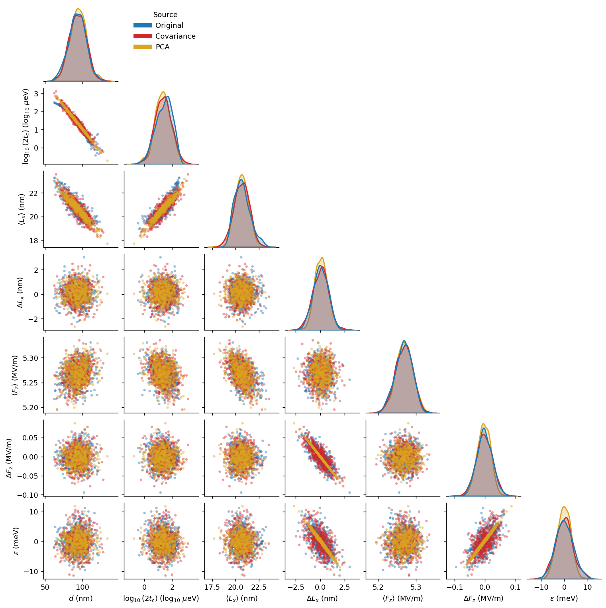
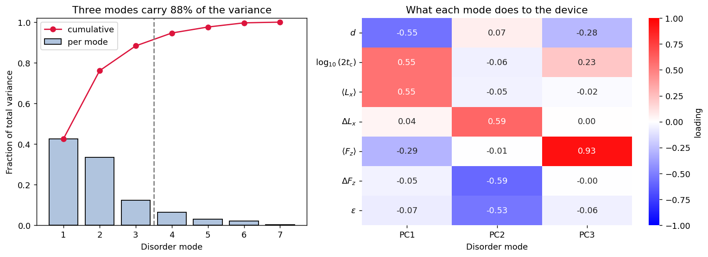
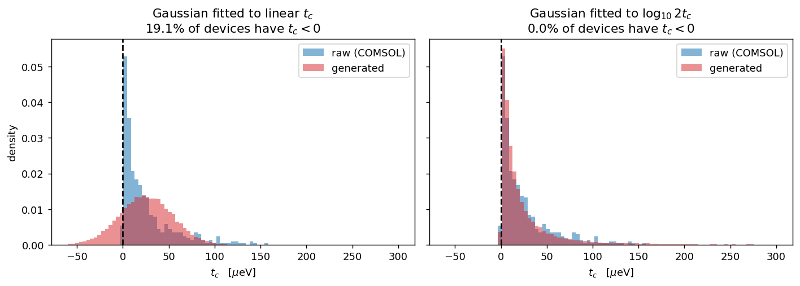
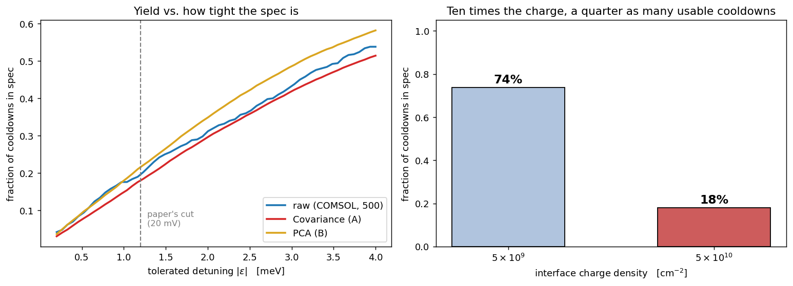

# ChargeTwin

**Generate realistic disorder realizations of a Si/SiGe double quantum dot — as many as you want, in a second.**

Charge trapped at the semiconductor–oxide interface makes every quantum dot device different, and makes the *same* device different after every cooldown. ChargeTwin takes a finite-element ensemble of disordered devices, compresses it into a generative model, and hands you an unlimited stream of synthetic, but statistically faithful, devices.

This is a proof of principle for one concrete device — specified in [`docs/device.md`](docs/device.md) — at the disorder strengths studied in [*Statistical Structure of Charge Disorder in Si/SiGe Quantum Dots*](https://arxiv.org/abs/2510.13578) (Samadi, Cywiński, Krzywda), whose results it reproduces.

**In progress:** an interface for supplying your own device geometry, and a generative model that interpolates across disorder strengths rather than fitting each one separately.

```python
import chargetwin as ct

raw = ct.load_dataset("rho5e10", ct.PAPER_PARAMETERS)   # 500 COMSOL realizations

gauss = ct.GaussianModel.fit(raw)                       # method A: full covariance
pca = ct.PCAModel.fit(raw, n_components=3)              # method B: 3 dominant modes

devices = gauss.sample(10_000, seed=0)                  # 10k synthetic realizations
devices = ct.add_tunnel_coupling(devices)               # log2tc -> t_c in ueV
```

## Install

```bash
pip install -r requirements.txt
jupyter lab notebooks/
```

Pure `numpy` / `pandas` / `scipy` — no `scikit-learn` needed.

## The notebooks

Run them in order; each stands alone.

| notebook | what it does |
|---|---|
| [`01_raw_data.ipynb`](notebooks/01_raw_data.ipynb) | Look at the raw COMSOL ensembles. Pick the parameters you care about. See that they are strongly correlated. |
| [`02_models_and_validation.ipynb`](notebooks/02_models_and_validation.ipynb) | The PCA. Fit methods A and B. Corner plot of raw vs. A vs. B. Quantify the trade-off. |
| [`03_cooling_rounds.ipynb`](notebooks/03_cooling_rounds.ipynb) | **The point.** Thousands of cooling rounds, from a precomputed or freshly-fitted model. Yield curves. Export. |

## One draw = one realization = one cooldown

Every thermal cycle re-traps the interface charge from scratch. So "another device off the same wafer" and "the same device after another cooldown" are the *same* draw from the *same* distribution, and there is one method for both: `model.sample(n, seed)`. The model deliberately carries no per-device memory. (If you believe some traps survive a warm-up cycle, that would be a different model — partial re-randomization between rounds — and it is not what this repo implements.)

## The two generative models

**A — Covariance (`GaussianModel`).** Multivariate normal with the empirical mean and full covariance matrix. Keeps every pairwise correlation; stores `p(p+1)/2` numbers. Reproduces the raw cloud to ~2% in covariance Frobenius norm.

**B — Dominant PCA (`PCAModel`).** Standardize, keep the `k` leading principal components, sample independent Gaussians along them, map back. Stores `k·p` numbers, and each mode is a *named physical distortion* of the device.



Blue is the real COMSOL ensemble, red is method A, yellow method B. Method A tracks the raw cloud everywhere. Method B reproduces the dominant correlations but collapses the residual scatter — the yellow points thin onto a line in exactly those panels whose spread lived in the discarded modes.

### The three disorder modes



| mode | variance (ρ = 5×10¹⁰ cm⁻²) | what it is |
|---|---|---|
| PC1 | 43% | **symmetric squeeze/stretch** — charge *between* the dots pushes them apart (`d` ↑), collapsing the tunnel coupling (`t_c` ↓) and shrinking the confinement (`⟨L_x⟩` ↓) |
| PC2 | 33% | **asymmetric tilt** — charge nearer one dot tilts the double well (`ε`, `ΔF_z`, `ΔL_x` together) |
| PC3 | 12% | **common vertical shift** — almost pure `⟨F_z⟩`; matters for valley splitting |

Three modes carry **88%** of all device-to-device variance. This is the result the paper's control analysis rests on: PC1 cannot be undone with the plunger gates alone — correcting it needs the barrier gate.

Both models share one interface — `.fit()`, `.sample(n, seed)`, `.save()`, `.load()` — so switching method is a one-line change anywhere downstream.

### The tunnel coupling is modelled in log space

`t_c` depends exponentially on the inter-dot distance (WKB), so its distribution has a long tail. `PAPER_PARAMETERS` therefore carries `log2tc = log₁₀(2t_c)` rather than `t_c`. This is not cosmetic: a Gaussian fitted to *linear* `t_c` reproduces the marginal badly **and** generates devices with a negative tunnel coupling.



Call `ct.add_tunnel_coupling(df)` to get `t_c` in µeV back.

## What it's for: yield under repeated cooldowns

Put an operating window on the parameters you care about and count what fraction of cooldowns land inside it. The model turns "how bad is charge disorder?" into a number you can compute for any spec, at any density, without running COMSOL again.



The window here is the paper's tunability criterion (Sec. III A): tunnel gap `2t_c` within 10–250 µeV, and under 20 mV of plunger correction needed to re-symmetrize the dot (`|ε| < 1.2 meV` through the lever arm). Sampling the fitted model reproduces the paper's tunability success rates — **74% and 18%**, against 76% and 20% measured on the full simulations — from a few kB of stored numbers.

## Data

`data/raw/` — two COMSOL ensembles, one row per disorder realization:

| dataset | interface charge density | realizations |
|---|---|---|
| `rho5e9` | 5×10⁹ cm⁻² | 500 |
| `rho5e10` | 5×10¹⁰ cm⁻² | 500 |

Both are *post-tuning*: the plunger gates have been adjusted to symmetrize each disordered double well, so we study variability around a consistent operating point. `load_dataset` converts to physical units and derives the dot-level parameters; `ct.PARAMETERS` lists all 12 available. The loader reproduces Table I of the paper exactly, and a test pins it there.

`data/models/` — precomputed fits (`.npz`, a few kB each), so a notebook can generate devices without touching the raw data. Regenerate the fits and the figures above with:

```bash
python scripts/fit_models.py
python scripts/make_figures.py
```

## Layout

```
chargetwin/          data.py (load + derive), models.py (A & B), metrics.py, plots.py
data/raw/            COMSOL ensembles (.pkl)
data/models/         precomputed fits (.npz)
docs/device.md       the simulated device: geometry, gates, disorder, extraction
notebooks/           01 raw data -> 02 models -> 03 cooling rounds
scripts/             fit_models.py, make_figures.py
tests/
```

## Citation

```bibtex
@article{samadi2025statistical,
  title={Statistical Structure of Charge Disorder in Si/SiGe Quantum Dots},
  author={Samadi, Saeed and Cywi{\'n}ski, {\L}ukasz and Krzywda, Jan A},
  journal={arXiv preprint arXiv:2510.13578},
  year={2025}
}
```

MIT licensed.
