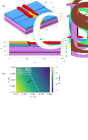

# The simulated device

Everything ChargeTwin generates is a statistical shadow of one finite-element
model: a gate-defined Si/SiGe double quantum dot, solved in COMSOL Multiphysics
for many random placements of trapped interface charge. This document specifies
that device, the disorder, and how each parameter in `ct.PARAMETERS` is
extracted from a solution.

Source: *Statistical Structure of Charge Disorder in Si/SiGe Quantum Dots*,
Samadi, Cywiński & Krzywda, [arXiv:2510.13578](https://arxiv.org/abs/2510.13578),
Sec. II.

<p align="center">
  
</p>

**(a)** The simulated structure. Top: the metallic gate layout — two plunger
gates (red) with a barrier gate (orange) crossing between them, above the Si/SiGe
heterostructure. Bottom: cross-section with every layer thickness. Yellow stars
mark trapped charges at the SiGe/SiO₂ interface — one random draw of these is one
*disorder realization*. **(b)** The left-dot orbital energy `E_L` across the
plunger-gate plane, from which the lever arms are fitted.

## Heterostructure

Grown along `ẑ` ∥ [001]. Simulation domain 660 × 582 nm².

| layer | thickness | note |
|---|---|---|
| metallic gates | `h_met` = 27 nm | width 45 nm |
| SiO₂ oxide | `h_ox` = 10 nm | ε_r = 3.9 |
| screening layer | `h_sc` = 10 nm | Dirichlet reference, `V_scr` = 0 |
| Si cap | `h_Si cap` = 1.5 nm | |
| SiGe top barrier | `h_top` = 60 nm | Si₀.₇Ge₀.₃, ε_r = 13.2 |
| **Si quantum well** | `h_Si` = 10 nm | ε_r = 12 — the electrons live here |
| SiGe bottom barrier | `h_bottom` = 30 nm | |

Channel width (the gap in the screening layer that defines the 1D channel):
`d_ch` = 142 nm. Conduction-band offset of the Si well relative to the SiGe
barriers: `U₀` = 150 meV. Transverse effective mass `m_t` = 0.19 mₑ. The
insulating region is treated as a hard wall (`U → ∞`) to confine the electron;
outer boundaries are homogeneous Neumann.

## Gates and the defect-free operating point

Three gates: two plungers (`V_L`, `V_R`) and one barrier gate (`V_B`). The
operating point the ensemble is generated around:

```
V_L = V_R = 0.35 V      V_B = -0.1 V
```

With no disorder present, this yields:

| quantity | value |
|---|---|
| tunnelling gap `2t_c,0` | ≈ 24 µeV |
| inter-dot distance `d₀` | ≈ 95 nm |
| dot size `L_x,0` / `L_y,0` | 20 nm / 18 nm (ratio 1.08 — slightly elliptical) |
| vertical field `F_z,0` | 5.34 MV/m |
| orbital excitation `E_orb` | ≈ 1.5 meV per dot |
| plunger lever arm \|α\| | 0.12 eV/V (`α_LL` = −0.11, `α_LR` = −0.044 eV/V) |

These are experimentally representative values, and they are chosen so the double
well *survives* disorder: at ρ = 5×10¹⁰ cm⁻² the potential still has two minima,
i.e. a DQD still exists and can be tuned.

## The disorder

Negative charges fixed at the SiGe/SiO₂ interface, at random positions, with
areal density ρ. The two shipped ensembles:

| dataset | ρ | realizations |
|---|---|---|
| `rho5e9` | 5×10⁹ cm⁻² | 500 |
| `rho5e10` | 5×10¹⁰ cm⁻² | 500 |

For **each** realization the Poisson equation is re-solved, giving a new
electrostatic potential and hence a new set of device parameters. This is the
model of both wafer-scale device-to-device variability *and* thermal-cycle
variability: a cooldown re-traps the charge from scratch.

## Tuning: what "after tuning" means

Raw disorder detunes the double well, so the two ensembles are **post-tuning**.
For every realization:

1. Set the gates to the defect-free operating point.
2. Sweep the plunger difference to locate the tunnel anticrossing — its presence
   confirms a DQD actually formed.
3. Adjust the plunger difference `ΔV_LR = V_L − V_R` (holding the plunger average
   and `V_B` fixed) until the double well is **symmetric**, i.e. zero detuning.

The plunger correction needed to get there *is* the reported detuning, converted
through the lever arm:

```
ε = α · ΔV_LR / 2          α = α_LL + α_RR − α_LR − α_RL
```

So `eps` is not a residual — it is the disorder-induced detuning that tuning had
to cancel, and it is the natural measure of how far disorder pushed the device.
Analysing the ensemble *after* tuning means we study variability around a
consistent operating point, not around whatever the gates happened to do.

## Parameter extraction

From each solved potential, the in-plane potential is fitted near its two minima
by harmonic wells:

- `E_D` — the minimum of the parabola at dot `D ∈ {L, R}`
- `(x_D, y_D)` — its position; the inter-dot distance is `d = |x_L − x_R|`
- `a_x,D`, `a_y,D` — the curvatures, `a = m_t ω²`

The dot size follows from the curvature:

```
L_x = (ħ² / (m_t · a_x))^(1/4)
```

`F_z,D` is read off at each dot position; `h_B` is the barrier height between the
minima; `t_c` comes from the anticrossing gap.

### The columns `load_dataset` returns

| column | symbol | unit | definition |
|---|---|---|---|
| `d` | *d* | nm | inter-dot distance |
| `tc` | *t_c* | µeV | tunnel coupling — **half** the raw file's `tcs`, which stores the gap 2*t_c* |
| `log2tc` | log₁₀(2*t_c*) | — | the modelling form of the coupling (see below) |
| `Lxavg` | ⟨*L_x*⟩ | nm | (L_x,L + L_x,R)/2 |
| `dLx` | Δ*L_x* | nm | L_x,L − L_x,R |
| `Lyavg`, `dLy` | ⟨*L_y*⟩, Δ*L_y* | nm | same along *y* |
| `Favg` | ⟨*F_z*⟩ | MV/m | (F_z,L + F_z,R)/2 |
| `dF` | Δ*F_z* | MV/m | F_z,L − F_z,R |
| `eps` | *ε* | meV | disorder-induced detuning cancelled by tuning |
| `Eavgs` | ⟨*E*⟩ | meV | mean orbital energy |
| `Bhs` | *h_B* | meV | inter-dot barrier height |
| `V_acs` | *V_ac* | a.u. | AC drive lever arm |

Two unit traps are handled inside `load_dataset`, and pinned by
`tests/test_models.py::test_loader_reproduces_paper_table`: the raw `tcs` field is
the tunnelling **gap** 2*t_c*, and the raw `Bhs` field is in **eV**, not meV.

### Why the tunnel coupling is modelled in log space

`t_c` depends exponentially on the inter-dot distance and the barrier height —
WKB gives

```
t_c = t_c,0 · exp( −β · d · √(2 m h_B) / ħ )
```

so small fluctuations in `d` and `h_B` produce large, strongly skewed swings in
`t_c`. Fitting a Gaussian to linear `t_c` reproduces the marginal badly and
generates *negative* tunnel couplings (a few percent of samples — see notebook
02). `PAPER_PARAMETERS` therefore carries `log2tc = log₁₀(2t_c)`, which is close
to normal. `ct.add_tunnel_coupling(df)` converts back.

This exponential sensitivity is also why `t_c` is the parameter that dominates
device yield: it is the one that moves by an order of magnitude when `d` moves by
a few nanometres.

## Statistical summary (reproduces Table I of the paper)

| parameter | ρ = 5×10⁹ | ρ = 5×10¹⁰ |
|---|---|---|
| *d* (nm) | 94.60 ± 3.10 | 92.75 ± 11.23 |
| *h_B* (meV) | 1.691 ± 0.203 | 1.678 ± 0.692 |
| *ε* (meV) | −0.072 ± 0.987 | 0.036 ± 3.683 |
| *F_z* (MV/m) | 5.337 ± 0.006 | 5.267 ± 0.022 |
| Δ*F_z* (MV/m) | <10⁻⁴ ± 0.006 | <10⁻³ ± 0.024 |
| Δ*L_x* (nm) | 0.009 ± 0.139 | 0.049 ± 0.761 |
| *L_x* (nm) | 20.37 ± 0.235 | 20.709 ± 0.837 |
| 2*t_c* (µeV) | 23.13 ± 9.13 | 50.30 ± 57.91 |

Mean ± standard deviation. The pattern that matters: raising ρ tenfold barely
moves the *means*, but inflates every *spread* — and the relative spread of
2*t_c* goes from 40% to 115%. Disorder is a variance problem, not a bias problem,
which is precisely why a shift of the operating point cannot fix it and a
statistical model is worth having.

## The three disorder modes

PCA on the standardized parameter vector (notebook 02) recovers three modes
carrying ~88% of the total variance:

| mode | variance (5×10¹⁰) | physical picture |
|---|---|---|
| PC1 | 43% | **symmetric squeeze/stretch** — excess charge *between* the dots pushes them apart (`d` ↑), collapsing the tunnel coupling (`log2tc` ↓) and shrinking the confinement (`⟨L_x⟩` ↓) |
| PC2 | 33% | **asymmetric tilt** — charge closer to one dot tilts the double well (`ε`, `Δ F_z`, `ΔL_x` together) |
| PC3 | 12% | **common vertical shift** — almost pure `⟨F_z⟩`; shifts both dots relative to the barrier, matters for valley splitting |

The paper's central control result follows from PC1: it cannot be undone with the
plunger gates alone. Correcting it requires the barrier gate.
